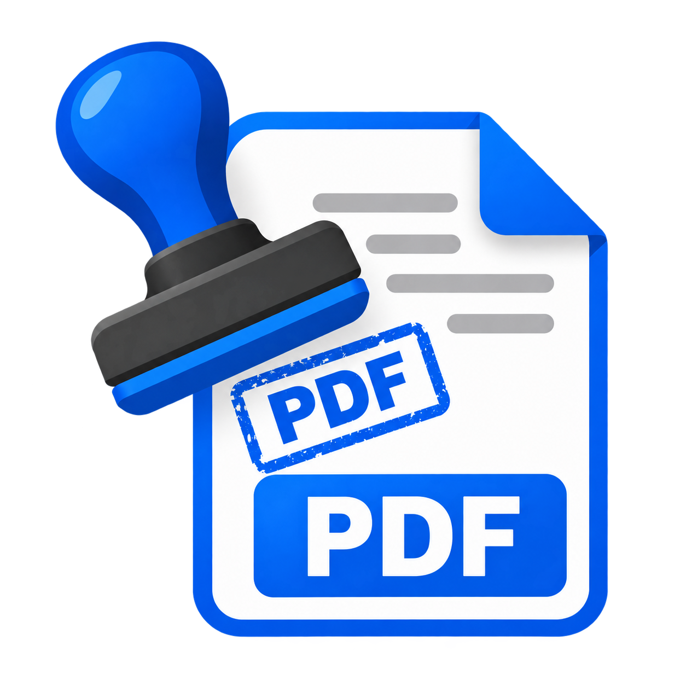

# CarimboPDF



Aplicação Python para carimbar PDFs com cidade e data em português, logo e proteção de edição.

**Windows:** [baixar o executável atualizado](https://github.com/maandrake/CarimboPDF/raw/refs/heads/main/dist/CarimboPDF.exe),
com a interface refatorada e o ícone corrigido. O arquivo fica em `dist/CarimboPDF.exe`.

## Instalação e execução

Requer Python 3.10+ com Tkinter. No Linux, instale também `python3-tk`.

```powershell
python -m venv .venv
.venv\Scripts\python -m pip install -e .
.venv\Scripts\python CarimboPDF_GUI.pyw
```

No Linux/macOS, use `.venv/bin/python`. No Windows, o atalho
`Iniciar - Carimbar PDF (GUI).cmd` cria o ambiente e instala a aplicação na primeira execução.

Após a instalação, `carimbopdf` abre a interface. `carimbopdf --help` mostra os parâmetros.
A execução por `python -m data_hora_pdf.cli` continua disponível, sem configurar PYTHONPATH.

## Interface

- **Documento:** entrada, saída, página e senha de abertura do PDF de entrada.
- **Carimbo:** cidade, data atual ou personalizada, fonte, estilo, cor e posição.
- **Logo:** imagem, largura, margem e busca automática opcional.
- **Proteção:** senha de edição e restrições com AES-256.

O processamento ocorre em outro processo para manter a interface responsiva.
A prévia mostra o texto do carimbo; não representa o posicionamento no PDF.
Uma nova instalação sugere uma cópia `_carimbado.pdf`. Preferências anteriores de
sobrescrita continuam válidas. Arquivos de saída existentes são substituídos.

## Linha de comando

```powershell
carimbopdf --input entrada.pdf --output saida.pdf --cidade "São Paulo"
carimbopdf --input entrada.pdf --in-place --cidade "Lages/SC." --date 03/09/2025
carimbopdf --input entrada.pdf --output saida.pdf --cidade "Brasília" --bold --color "#123ABC" --logo-path Logo.jpg
carimbopdf --input entrada.pdf --output protegido.pdf --cidade "Curitiba" --protection-password "exemplo" --restrict-editing --no-copy
```

`--no-city` e `--no-date` controlam as linhas individualmente. `--no-auto-logo` desativa
a busca automática. `--input-password` permite abrir um PDF de entrada protegido.
Datas inválidas ou futuras são rejeitadas nas duas interfaces.
Erros de processamento retornam código 1; argumentos incompletos retornam código 2.

## Posição e logo

Para manter compatibilidade com o modelo existente, os padrões continuam sendo
cidade em **(337, 280)** e data em **(391, 307)** pontos. A origem é o canto superior
esquerdo da página sem rotação. Esses valores são específicos do modelo e podem
exigir ajuste em páginas pequenas ou textos grandes. Não há ajuste automático de texto.
Use `--x` e `--y`, ou os campos na interface, para configurar a posição.
Com posição personalizada, Y indica a base da última linha; o espaçamento é 1,2 × tamanho da fonte.

O logo mantém proporção e transparência, no canto inferior esquerdo da página sem rotação.
A busca considera o diretório de trabalho, a pasta do PDF e, no executável,
a pasta do programa e os recursos embutidos. Um caminho explícito inválido gera erro.
Um logo que não cabe na página também gera erro.

## Salvamento e proteção

O PDF é escrito em um arquivo temporário exclusivo na pasta de destino. Somente após
salvar e fechar o documento com sucesso, ele substitui o destino. Falhas de escrita,
imagem ou criptografia não substituem o arquivo existente. Não há fallback sem proteção.

A proteção nova usa AES-256, inclusive sem `--encrypt-content`, mantido por compatibilidade.
Restrições exigem senha de edição. O PDF de saída abre sem senha; as permissões dependem
do leitor e não garantem bloqueio absoluto de cópia. A acessibilidade permanece habilitada.
Sem nova senha de edição, a criptografia e permissões existentes são preservadas.
Modificar PDFs assinados pode invalidar assinaturas digitais.

## Preferências

As opções ficam em `~/.data_hora_pdf/config.json`. Arquivos inválidos recebem padrões
válidos; a gravação é atômica. Senhas não são carregadas nem gravadas. A opção antiga
“Salvar como padrão” foi removida; uma senha antiga no JSON é descartada no próximo
salvamento das preferências. `CIDADE_PADRAO` continua disponível.

## Desenvolvimento

```powershell
python -m pip install -e ".[dev]"
ruff check src tests
ruff format --check src tests
pytest -q
python scripts/make_dummy_pdf.py
```

Estrutura:

```text
src/data_hora_pdf/
  cli.py       argumentos e execução no terminal
  gui.py       interface em abas e processamento assíncrono
  stamper.py   carimbo, imagens, proteção e salvamento
  dates.py     validação compartilhada de datas
  config.py    preferências validadas, sem senhas
tests/         testes de regressão e integração
```

O workflow testa Python 3.10, 3.12 e 3.14 em Windows e Linux.
Consulte [EXECUTAVEIS.md](EXECUTAVEIS.md) para gerar o executável.
As versões são declaradas em `pyproject.toml`; a atualização foi validada localmente
com PyMuPDF 1.28.2, Pillow 12.3.0 e tkcalendar 1.6.1 em Python 3.12.

## Referências técnicas

- [PyMuPDF: salvamento e criptografia](https://pymupdf.readthedocs.io/en/latest/document.html#Document.save)
- [PyMuPDF: permissões](https://pymupdf.readthedocs.io/en/latest/vars.html#document-permissions)

Projeto de uso interno — Marcos Despachante.
